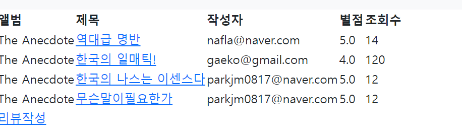
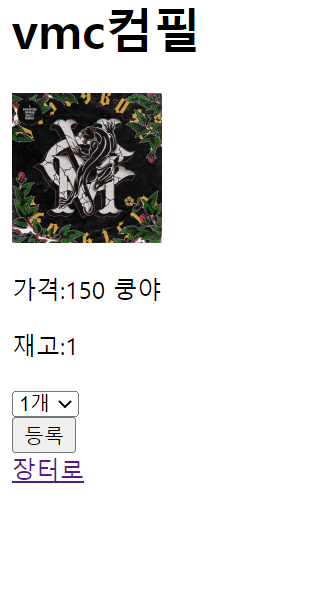

# PreparingForRapperSite
래퍼 사이트를 만들기 위한 사전준비

### [1주차 미션 구현사항 정리](docs/1week/README.md)

### [2주차 미션 구현사항 정리](docs/2week/README.md)

### [3주차 미션 구현사항 정리](docs/3week/README.md)

### [4주차 미션 구현사항 정리](docs/4week/README.md)

### [5주차 미션 구현사항 정리](docs/5week/README.md)

### [6주차 미션 구현사항 정리](docs/6week/README.md)

## 프로젝트 목표

- 기본적인 백엔드 환경 구축 학습
- 효율적인 로직 구현 학습

### 기능

- 앨범, 믹스테잎 등록  

- 앨범, 믹스테잎 리뷰  

- 굿즈 장터 

### 백엔드

### 프론트

