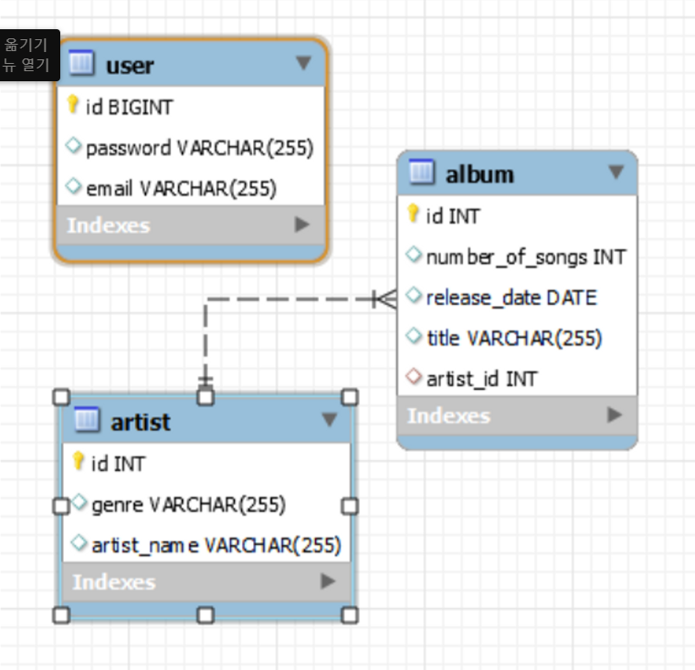

### 기능 요구 사항

웹에서 아티스트명, 앨범이름, 수록곡, 참여진, 발매일을 입력하면  
아래와 같이 게시판에 추가되고, 눌렀을 경우 작성한 내용이 보이도록 구성.

### MVC 패턴 기본 구조화
데이터 베이스 설계

- 목록페이지 구성하는 단계에서 큰 대주제를 생각해보았다.
- album 엔터티 -수록곡수, 발매일자, 제목, 아티스트ID(외래키)
- artist 엔터티 - 장르, 아티스트 이름
- user 엔터티 - email, password, id

### Intelij 와 Eclipse의 차이

- 몇년 전부터 intelij 유저들이 많이 보이길래 그게 그리 좋은가 생각했었다.
- 재연상이 주로 사용하는 intelij와 나의 eclipse가 서로 호환이 안돼서 얼떨결에 intelij 무료버전을 사용하게 됐다.
- 확실히 eclipse에 비해 버전관리와 간결함, 구동속도, 여러면에서 뛰어난 장점들이 보였다. 대신 eclipse에서는 코드 변화가 즉시 반영되지만, intelij에서는 다시 돌려야되는 단점도 있었다. 그것빼고는 개발환경측면에서 편리하다.
- 가상서버 가동시 프로젝트 전체가 돌려지는 eclipse와 달리, 패키지 부분부분(?)으로 돌려지는 것같았다. 그래서 그것때문에 초반에 좀 애를 먹었다. 이건 추후에 재연상하고 얘기해봐야겠다.

### 느낀 점

- 인텔리제이가 생각보다 너무 편했다. 왜 진작에 사용하지 않았을까.
- thymleaf에 대한 공부가 필요할 것 같다.
- gradle과 maven은 큰 차이점이 없었다.
- 학부의 수업을 들으면서, 교수님이 가르쳐준 기술들을 주로 사용해 왔는데, 이번주 미션을 진행하면서 너무 우물안 개구리식으로 개발을 진행해왔다는 것을 느꼈다.