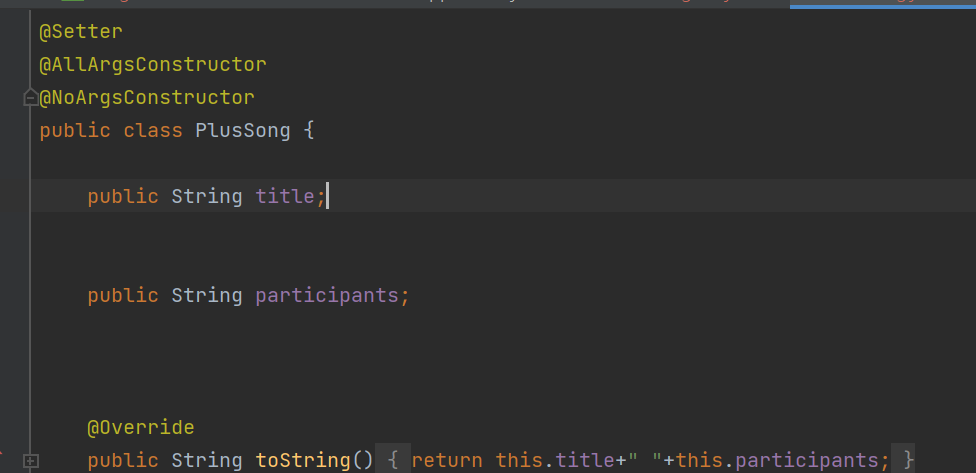

- 기능요구사항
- 곡, 곡에 대한 리뷰, 기본적인 로그인 구현

# DB구조화

- 앨범
  제목, 수록곡 수, 발매일자, 아티스트명, 소개글, List<수록곡>
- 아티스트
  장르, 아티스트명
- 수록곡
  앨범제목, 제목, 수록곡번호, 참여진
- 앨범리뷰
  userId, 앨범, 별점, List<수록곡리뷰>, 제목, 총 리뷰
- 수록곡리뷰
  앨범리뷰Id, 수록곡, 글내용
- 댓글
  user, 게시 일자, 내용
- User
  UserId, password, email

→ 앨범리뷰 insert 및 표시 문제

-애초에 수록곡을 따로 엔터티로 파서 상위 엔터티인 앨범에 외부키를 놓는 방식.

이렇게 되면 따로 유저가 리뷰 추가를 하지 않아도, 미리 검색후 수록곡별로 게시할 수 있음.

# 로그인

[[Spring Boot] 쿠키, 세션](https://bestkingit.tistory.com/145)

[스프링 부트 - 로그인1: 쿠키, 세션](https://velog.io/@gmtmoney2357/%EC%8A%A4%ED%94%84%EB%A7%81-%EB%B6%80%ED%8A%B8-%EB%A1%9C%EA%B7%B8%EC%9D%B8-%EC%BF%A0%ED%82%A4-%EC%84%B8%EC%85%98)

전체적인 페이지의 로직과 스프링시큐리티를 이용하려면, 먼저 로그인 유지문제부터 해결해야 했다.

먼저 페이지의 ID역할을 하는 Email을 쿠키에 저장해, 필요할 때마다 꺼내쓸수 있도록 설정을 해주었다.

하지만 문제가 생겼다.

위 방법 대로 하니 Email을 담아준 쿠키(memberId)가

home 에서 꺼낼때 타입이 맞지 않는 문제가 생겼다.

결국 String으로 바꿔주긴 했는데…. velog 필자는 분명 Long타입을 String으로 바꿔준다고 했다…..

일단 잘돌아가긴해서 냅뒀다…

→ ~님 어서오세요 라는 텍스트를 띄우고 싶었는데 텍스트가 안먹는다. thymleaf 문법을 아직 잘 몰라서 그런것 같다.

# Insert

뷰 페이지를 작성후, 앨범 추가 기능을 넣기위해 Dto와 뷰페이지를 구성하였다.

DTO

Insert 뷰

앗! 근데 오류가 난다.

추정컨데 numberOfSongs 의 타입과 뷰페이지 타입이 일치하지 않아 발생하는 문제 같았다.

인터넷에서 찾아보니 int타입을 html에서 안먹는다 한다.

int→ Integer로 고치니 문제가 해결되었다.

하나 넘기나 했는데….

또! 들어온 DB가 잘들어왔나 확인하는 과정중에 콘솔창에서 글자가 깨지는 현상이 발생하였다….

대충이렇게….

해결방법은 [ Ctrl+Shift+A ] 누르고 vm을 검색하고 [Edit Custom VM Options...] 클릭,

-Dfile.encoding=UTF-8

을 넣어주고 다시 실행시키면 된다.

# List Parameter 전송 문제

앨범 추가시 앨범을 추가한뒤, 그 앨범에 수록되있는 곡을 폼으로 추가하여,

앨범추가를 최종적으로 마치려고 했다.

역시나 그랬듯이 문제가 발생했다.

추가뒤 등록버튼을 누르면,

List가 parameter로 전송이 안되는 문제가 발생했다.

정말 긴시간 찾아본 결과,

List를 넘기려면 ajax를 사용하는 게 바람직하며,

ModelAttribute는 List parameter를 지원하지 않는다고 한다.

그 외에도 이것저것 시도해 보았으나 전혀 진전이 없었다…

→ 허나 재연상의 도움으로 해결했다!

따로 객체를 하나 만들고 그안에 List를 선언해야 했다!

내심 조금 비효율적인거 같긴하다.

springboot 잘못이 좀 있다.

이렇게 PlusSongDto 선언후,

타입을 선언해준다.

그러면 이렇게 plusSongDto를 받아 list를 꺼내 쓸수있다!

# 느낀점

-투자하는 시간에 비해 너무 느리다…..

첫째로, 재연상의 코드와 비교해본 결과 내 웹 구조는 매우 복잡하다.

안그래도 thymeleaf와 springboot를 마스터한 것도 아닌데

구조까지 복잡해지니 더욱 기간이 오래 걸린다…..

둘째로, 회의한대로 진행을 안했던 것 같다.

회의에서 정한 틀까지 완성 시킨 후,

부가적으로 기능을 추가했어야하는데

1도 못하면서 2,3까지 나가고 있는 내자신을 보았다.

셋째로, thymeleaf외 html에 대한 기본이해도가 낮다.

여태 restApi로 프로젝트를 진행했었고,

전공 수업에서도 html에 대해 공부를 놨었다…