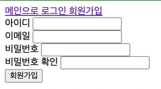

- 회원가입

- 로그인

- 로그아웃

로그인을 하면 로그아웃으로 바뀌어있고

로그아웃을 누르면

로그인으로 다시 바뀐다.

- 앨범 작성 페이지 (어드민 권한을 유저만 가능)

- 앨범 목록 페이지 (메인 페이지)

- 앨범 상세 페이지

- 댓글

댓글을 달게 되면 추가된다.

- 리뷰 목록 페이지

- 리뷰 작성 페이지

- 리뷰 상세 페이지

- 기능 구현 리스트
  1. 로그인
  2. 로그아웃
  3. 회원가입
  4. 앨범 추가
  5. 앨범 조회
  6. 앨범 상세 조회
  7. 댓글 추가
  8. 리뷰 조회
  9. 리뷰 추가
  10. 리뷰 상세 조회

- 느낀점

이번주 미션도 너무 재미있었다.

근데, 조금은 아쉬운 것이 있다.

바로, 이번주에 시간이 조금만 더 있었더라면 더 완벽하게 기능들을 구성할 수 있었을 것 같다는 점이다.

근데 다음주도 있으니까, 새로운 기능들도 추가하고 현재 기능들을 더 보완할 생각이다.

예를 들어 Validation 하는 부분들을 꼼꼼하게 해주고, 대댓글과 같은 기능들도 만들어 보완해줄 생각이다.