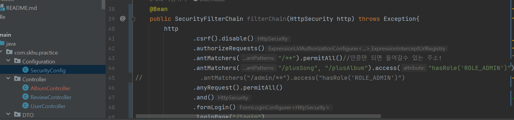
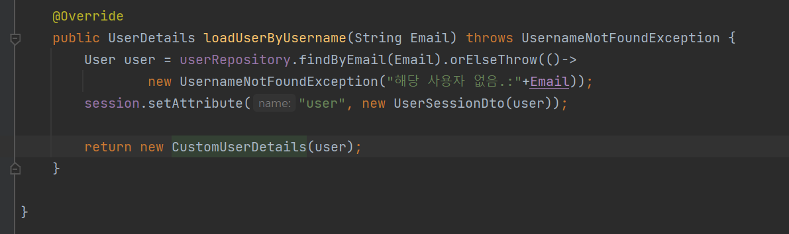

# MySQL을 h2로 바꾸기

솔직히 처음엔 Mysql로 당연히 작업해야 맞는 것 같았으나,

지금은 페이지 개발단계에 있다는 것,

그리고 많은 데이터를 필요로 하지 않는 단계 있다는것,

그리고 개발단계에서 Mysql 사용은 로딩이 무겁다는

재연상의 말에 수긍하게 되었다.

따라서 Mysql을 h2로 이관하는 작업을 시작했다.

h2로 sql-datasource 를 바꾸고,

implements를 수정하면!

짜잔! 오류가 발생한다!

계속 알아봤는데 User 테이블의 이름이 h2문법과 충돌이 나서 발생하는 문제다.

이렇게 USER 테이블의 이름을 USER_TABLE로 바꿔주고 돌리면

생성이 된다.

h2와 약간의 문법 차이가 있을 수 있어서

;MODE=MYSQL 을 추가해줬다.

이렇게 하면 MYSQL 문법으로 h2를 운용할수 있다.

# 삽질…..

SongReview 엔터티를 지우고

@ElementCollection 와 @CollectionTable 어노테이션을 이용해

데이터베이스에 원큐에 AlbumReview에 담길수 있도록 코드를 수정하였다.

Album_Reviews에 따로 담기는 모습.

그런데….

아무리 리뷰를 써 전송을 보내도

Album_Reviews에 안담기는 것이었다!

원인을 찾기위해 고군분투하며 시간을 태웠지만

아무리해도 담기질 않았다….

이것저것 로그를 찍어보던중….

…..setReviews를 안해줘서 발생한 문제였다…..

하루를 날려먹고 여기서 교수님의 말씀을 다시 되새겼다.

“개발은 오류와의 싸움이다.”

원큐에 코드가 완벽하게 구현된다면,

아마 나는 학교를 때려치우고 한국 굴지의 벤처기업을 운영하고 있었을 것이다.

개발하면서 내려놓아야한다.

어차피 오류는 발생할 것이고, 나는 그것을 수정하며 완성시킬 것이다.

오늘 하루 삽질의 교훈이었다…

# Spring Security(오류)

이제 얼추 사이트의 틀이 완성이 되었으니

스프링 시큐리티를 이용해 로그인 및 회원들의 보안을 설정했다.

- Security Config

- UserDetails - loadByUsername

- 암호화가 잘진행된 모습

이렇게 회원가입 절차는 완성이 되었으나,

로그인에서 맞는 아이디와 패스워드를 입력해도

로그인이 되지 않는 문제에 고착했다.

- 어떤 로그인에도 실패가 뜨는 모습

loadByUsername 오버라이딩 문제 혹은 시큐리티 Config의 문제일까.

거의 이문제로 하루를 썼지만 수확은 없었다.

그런데…..

- usernameParameter와 passwordParameter안에 templates의 name 설정과 맞춰야 한다.

이 두줄을 추가하니 해결됐다…

알고보니 로그인페이지를 자체 제작할시 usernameParameter와 passwordParameter를 꼭 붙여줘야 한다고 한다….

돼서 다행이긴 하지만

security에 대한 전반적인 부분에 대한 이해가 부족해 발생한 문제였다.

# 느낀점

생각보다 오류가 너무 많았다.

지난주와 달리 알고리즘 공부도 제쳐둔체 많은 시간을 쏟았지만

자잘한 오류부터 시작해, 로그인 문제까지

거의 오류만 수정하다 끝난 한주였다.

그러나,

이런 오류를 고쳐나가는 과정에서 많은 성장을 체감했다.

오류는 매번 달갑지 않지만, 성장의 기회라 생각하고 최선을 다해야겠다.