### 설계 과정

### 페이지 권한 설정

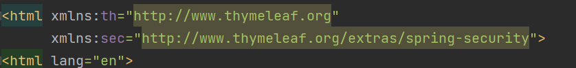
html에서 spring security를 이용하려면 xmlns:sec 태그를 이용해야한다.

sec 태그를 이용할 페이지에 위와같이 태그를 명시해 준다.

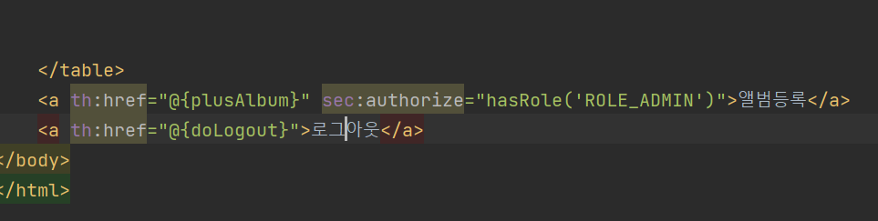
위와 같이 명시해주면 ROLE이 ADMIN이 아닌 회원은 버튼을 볼수가 없다.

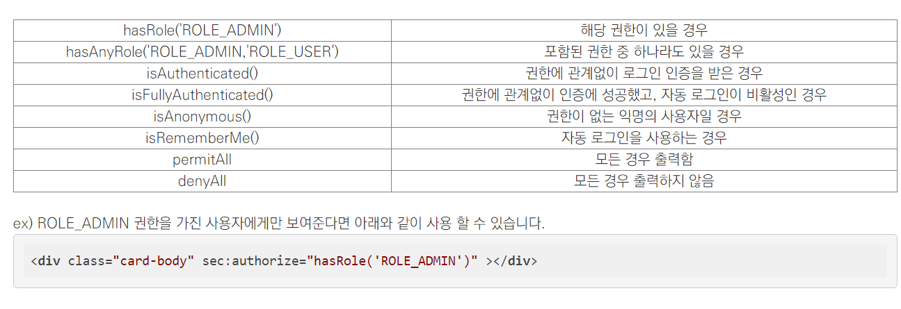
그 외 sec 권한 태그.

### 로그아웃

로그아웃은 로그인과 달리 간단했다.

그냥 스프링 시큐리티에서 로그아웃 url을 설정한뒤,

href 태그로 로그아웃 url을 추가해주면 알아서 로그아웃이 된다.

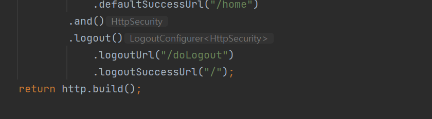
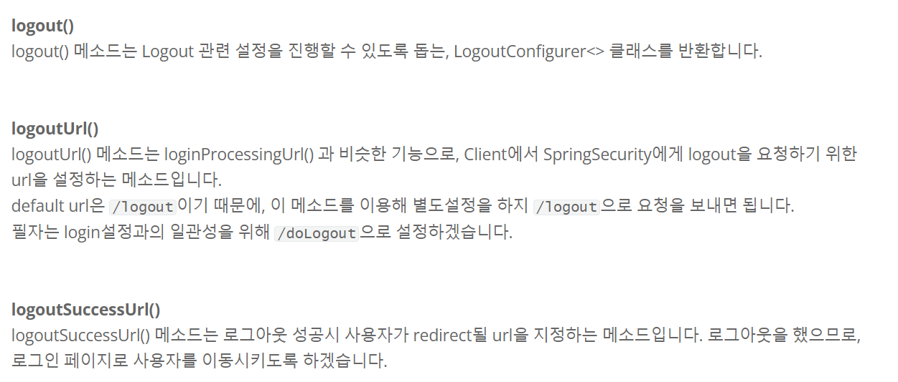
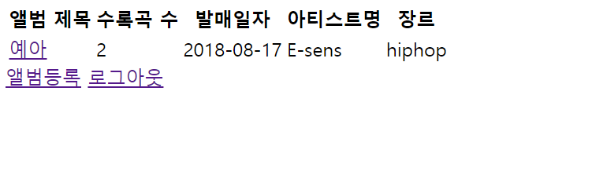
### BaseEntity(createDate, modifiedDate)

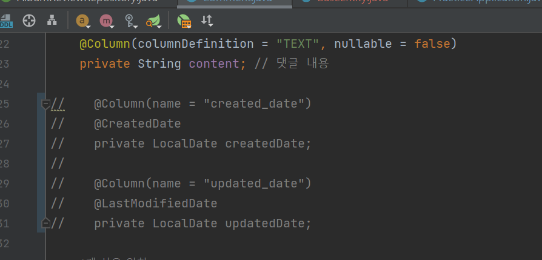
처음엔 이렇게 @CreatedDate 와 @LastModifiedDate 어노테이션만 붙이면 알아서 기록이 될줄 알았다

하지만 나의 큰 착각이었다.

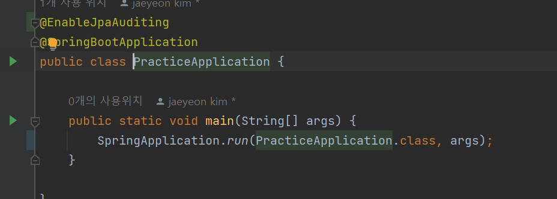
이렇게 어플리케이션에 @EnalbeJpaAuditing 어노테이션도 붙여줘야 하고,

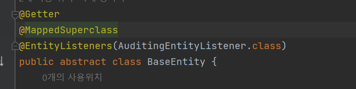
이렇게 @EntityListners(AuditingEntityListener.class)도 붙여줘야 한다.

**하지만 웹사이트에서는 생성시간과 수정시간이 많이 반복적으로 쓰인다.**

그렇기에 BaseEntity 추상클래스로 이 기능들을 빼줘서

유지보수가 쉽게 구상해줘야 좋은 코드가 된다.

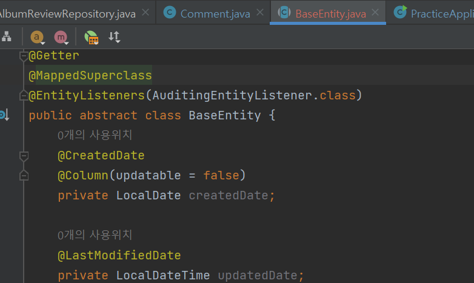
BaseEntity

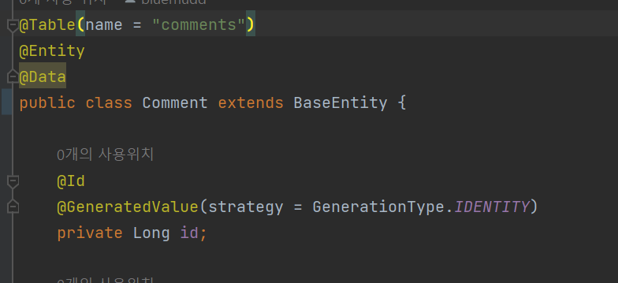
요렇게 상속하여 사용

### 막바지 기본 웹 구성 마무리

계속 미뤄왔던 조회수와 별점을 추가했다.

- 조회수

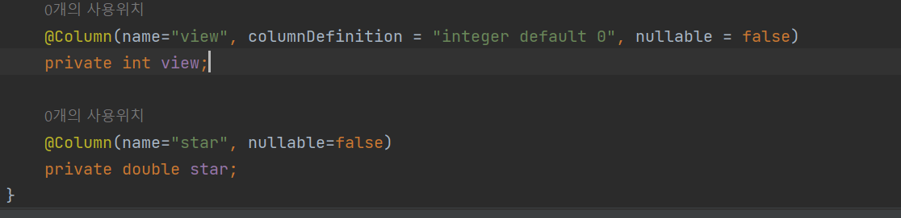
→ albumReview 엔터티에 view(조회수) 컬럼 추가

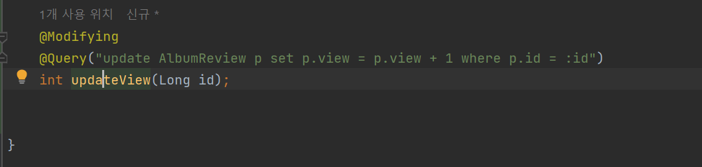
→ AlbumReviewRepository 에서 Query로 명령문 추가후 update 처리.

-@Modifying 어노테이션?

-@Transactional의 기능에 대해 조금 깊게 알고싶어졌다.

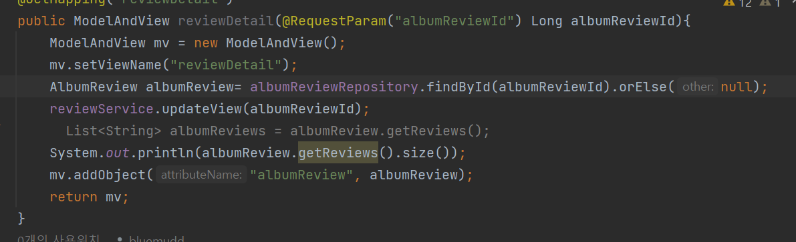
- 조회 메소드를 넣으면

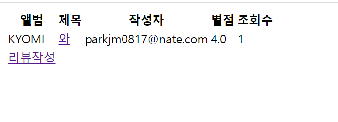
완성이다!

별점은 위에 star 컬럼을 추가하여 처리해줬다(넘모 간단해서 따로 쓰진않았따)

이렇게 얼추 모든 웹 구성이 끝났다.

약간의 세밀한 오류들이 있으나,

앞으로 다른 기능을 추가하며 보완해 나가야겠다.

### 레이팅 시스템

이 구조를 만들기 위해서는 sql문을 적극 활용해야겠다고 생각했다.

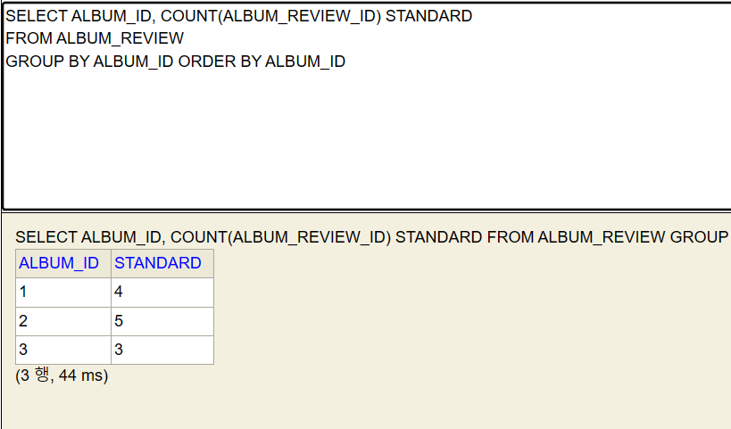
리뷰 많은순

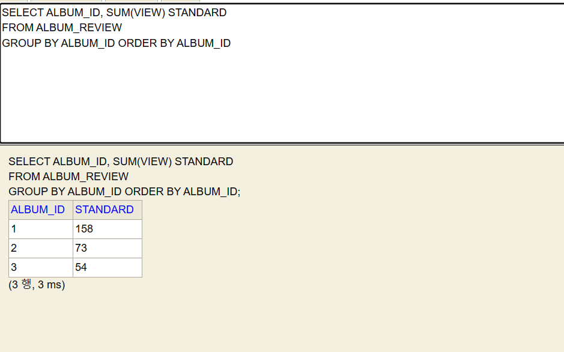
조회(리뷰)수 많은 수

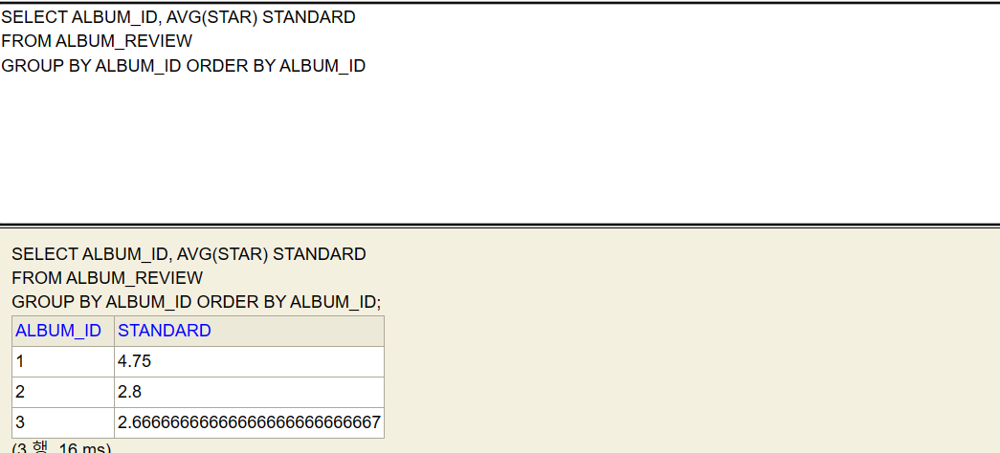
평점 높은순

이렇게 세개의 기준으로 먼저 앨범의 순위기준을 정했다.

이 명령문을 springboot에서 실행시키기 위해서는 @query 문이 필요했다.

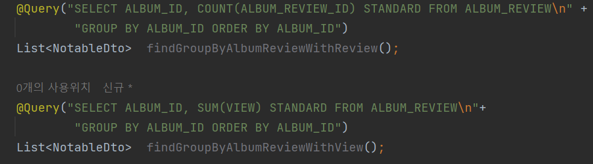

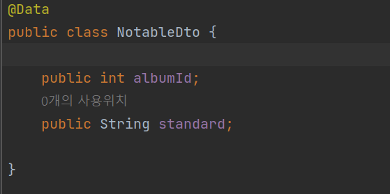
→ DTO 생성

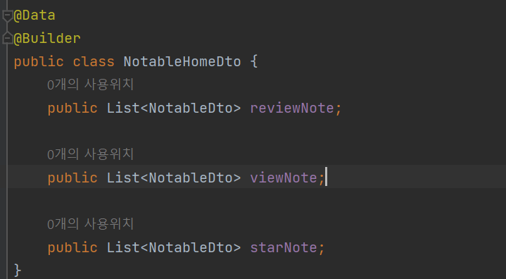
→ 컨트롤러에 뿌려줄 DTO 생성

지난시간에 재연상이 강조한 Builder 패턴을 한번 이용해보려고 한다.

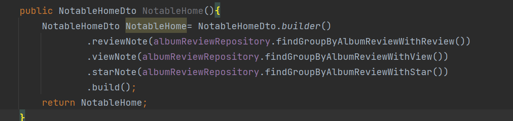
요렇게

이렇게 하면 잘 될줄 알았으나….

빨간줄이 아름답게 수놓는 것을 볼수 있다.

이유가 뭘까?

대충 에러코드를 보니 형식이 안맞는다고 되있는 것같은데…

찾아보니 springboot에서 group by를 이용하려면 약간의 준비가 필요하다고 한다.

그래서 집계함수를 명시해주는 것이 아니라,

단순히 순위만 나타내게끔 추출하여 쓰기로 하였다.

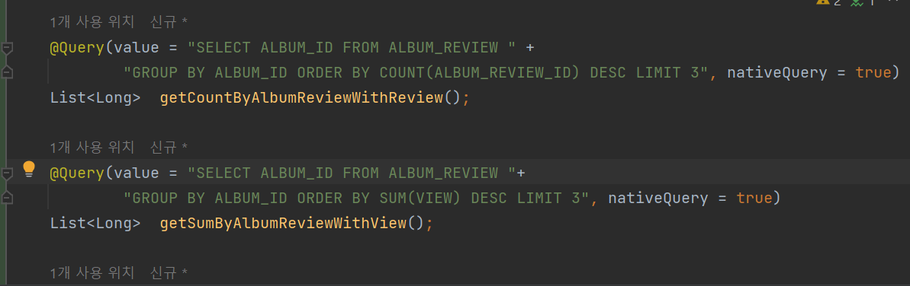
SELECT문에서 집계함수 목록을 뺐다. 또한 Dto가아닌 단순 Long 타입으로 결과값을 받아온다.

비록 자세한 집계값을 알수는 없으나,

순위를 표시하는데에는 손색이 없다.

하지만 추후에 왜 위와 같은 오류가 떴는지는 더 조사해봐야 겠다.

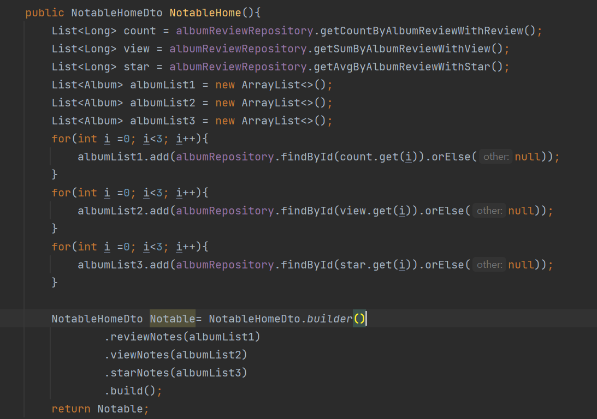
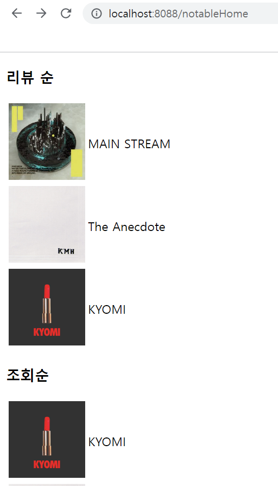
→ 성공

이미지로 들어가면 앨범 정보 페이지로 들어갈수 있으며,

그안에서 새롭게 리뷰를 쓸수 있다.

늦었지만 3주차 내용의 개괄적인 내용은 완성하였다.

### 인코딩 문제

지난 시간 앨범을 추가하게 되면 한글이 깨져서

노래추가 form 에서 GetMapping으로 받아온 제목이 물음표로 처리되었다.

이를 해결하고자 구글링을 해본결과,

html에서는 ASCII코드만 을 지원하기때문에 한글을 표현할수 없는 문제라고 한다.

따라서 한글로 queryString 을 보내려면 인코딩과정을 거쳐야한다.

출처:[https://ivvve.github.io/2019/01/20/java/Spring/redirect_URL_encoding/](https://ivvve.github.io/2019/01/20/java/Spring/redirect_URL_encoding/)

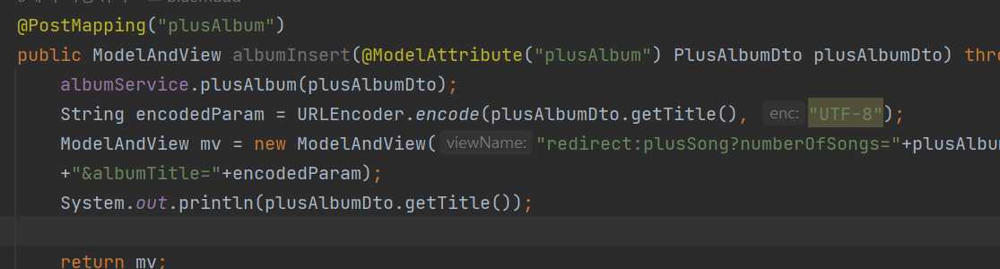
보내고자하는 String을 URLEncoder라이브러리의 encode메소드를 이용하여 바꿔준후 보내준다

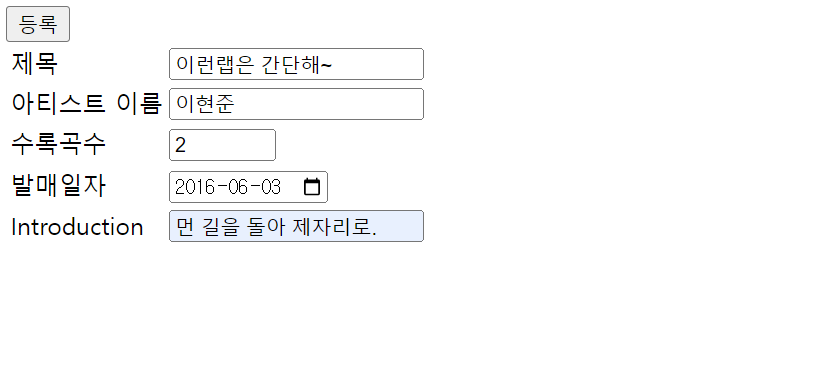
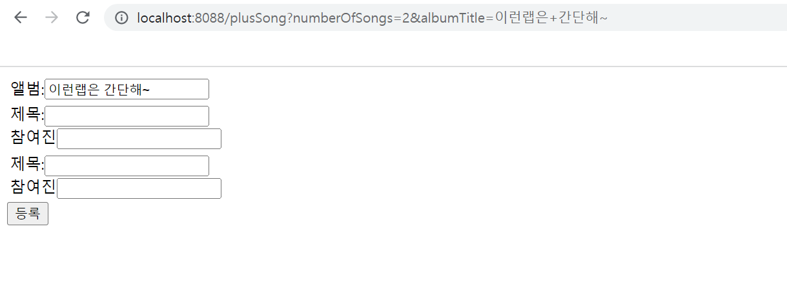
성공적으로 String이 보내지는 결과를 얻을 수 있었다.

### 믹스테잎 커뮤니티 개발

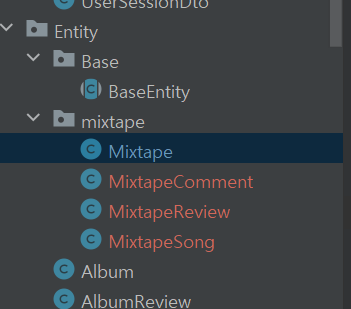
처음엔 앨범 커뮤니티 처럼 개발하면 될것 같았다.

그래서 앨범 커뮤니티와 유사하게 개발을 진행하려 했다.

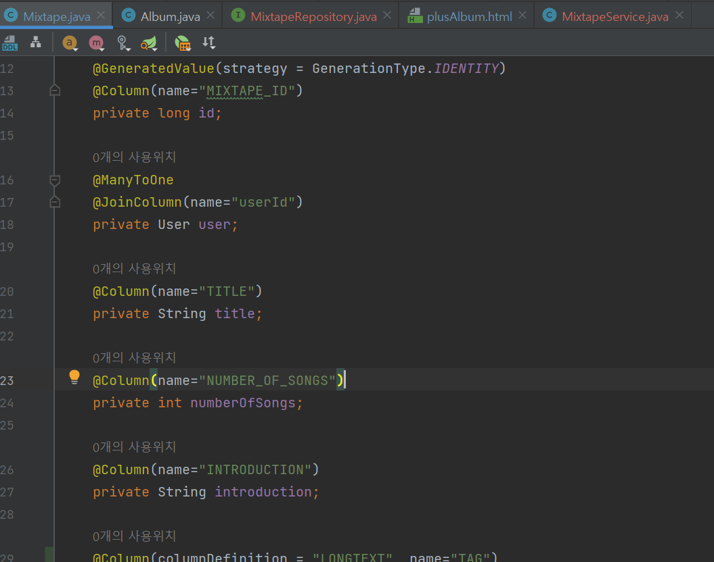
하지만 개발을 진행하다보니 몇가지 의문점들이 생기기 시작했다.

이것은 개발적인 측면보다 유저들이 커뮤니티를 이용하면서 생기는 심리와 관련된 문제다

→ 과연 유저들이 아마추어의 앨범들을 주위 깊게 들어볼까?

애초에 우리는 모든 아마추어 아티스트들이 만든 작업물을 주의 깊게 들어보며 리뷰를 하길 원했다.

하지만 유명 아티스트의 앨범처럼 모든 기능을 유사하게 진행한다면,

기존 커뮤니티에서 되풀이 되왔던 문제들이 지속될 것 같았다.

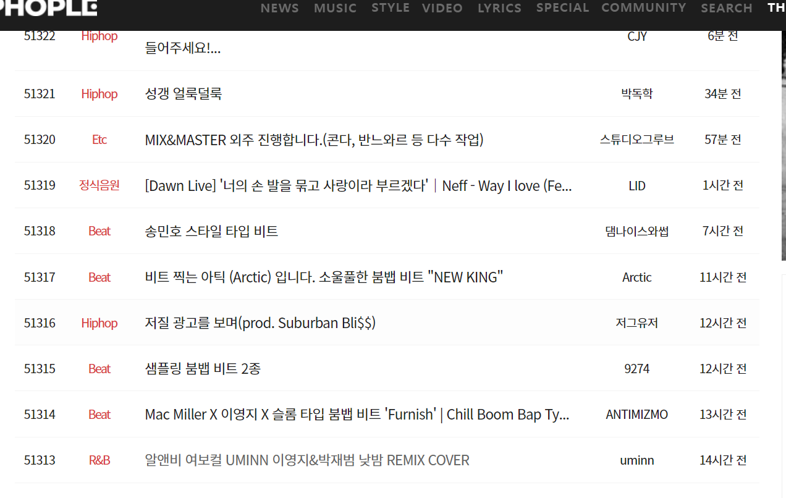
위와 같은 엘이사이트 워크룸(아마추어 유저 작업물 게시판)은 몇년째 활기를 잃어간채 댓글조차 달리지 않는다.

그저 지난번에 개발했던 앨범 리뷰게시판을 똑같이 답습하여 개발한다면, 위 같은 게시판처럼 활기를 잃을게 뻔하다. 애초에 누가 아마추어 작업물을 꼼꼼히 볼까?

나는 이에 대한 답을 퀄리티에서 찾았다.

‘아마추어의 작업물은 퀄리티가 형편없다’ 라는 인식자체가 널리 퍼져있어 아마추어의 수작조차 듣게되지 않는 것이다.

조금더 다른 차원의 접근이 필요하다. 단순한 게시판 개발이지만 애초에 이 웹사이트의 목적은 ‘앨범청취 문화 발전과 언더그라운드 아티스트들의 창작문화 발전’ 이 목표였다.

이부분에 대해서 재연상과 조금더 깊은 대화와 고민이 필요할것 같다.

### 느낀 점

이번 주는 상대적으로 오류가 많이 뜨지않아 개발이 수월했다.

재연상이 제안한 기술을 통해 많은 것을 배웠고, 알아가는 과정또한 매우 즐거운 개발이었다.

허나 개발이 수월해지니 개발 목표에 대해 깊은 고민을 하게 되었다.

과연 우리가 개발하는 프로젝트가 단순히 게시판 프로젝트에서만 끝날 것인지,

혹은 좀더 다양한 관점에서 완성도있는 백엔드 개발이 될것인지.

재연상과 좀더 많은 이야기가 필요할것 같다.