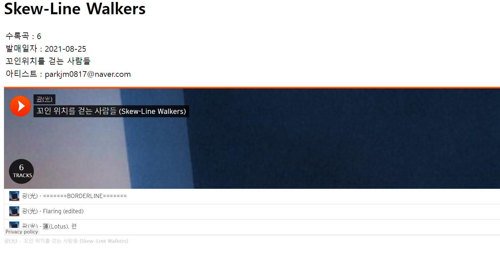
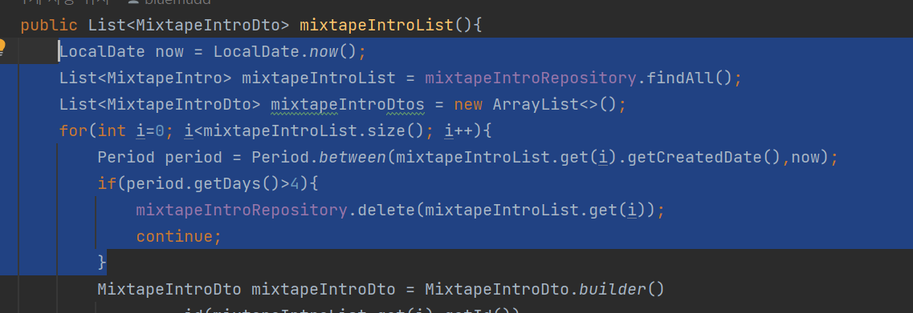
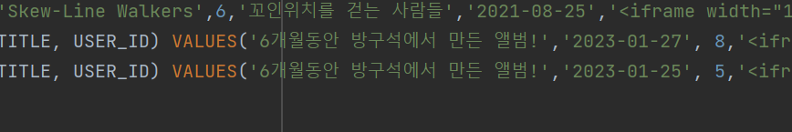

# 5주차

### 설계 과정

### 믹스테잎 게시판 설계

좀더 유저들이 아마추어 아티스트들의 작업물을 쉽게 접근하려면,

조금더 작업물을 노출시키는 빈도가높아야겠다고 생각했다.

고로 mixtapehome 창에 신규 믹스테잎을 띄우고

유저들이 추천하여 5개가 넘어가면 본격적인 믹스테잎 게시판에 입성시켜

조금더 능동적인 구조가 될수 있도록 했다.

먼저 믹스테잎을 등록하면 믹스테잎 홈으로 작업물의 사클임베드가 뜨게된다.

회원들이 5번이상 추천을 누르게 되면 믹스테잎게시판에 입성할수 있게되고,

만약 5일 안으로 5개를 못받았다면, 삭제시키는 방식으로 구성하였다.

추천 누가했는지 알수있게끔 구성

5개이상이되면 믹스테잎 게시판 입성.

믹스테잎들이 있는 게시판

믹스테잎 상세

이렇게 구성은 순조로운 편이었다.

하지만 이틀내내 내 발목을 잡아끈것이 있었으니….

사클 임베드 js 함수 호출이다.

이상하게 태그별로 함수가 적용되지않고

첫번째 임베드가 두번째 임베드구간에 띄워지거나

아니면 태그마다 모든 임베드가 통째로 띄워졌다….

JQuery로 수정할수 있다고했으나

전혀 통하지않았다…

이렇게 동시에 뜬다…

짧은 지식으로 애를 써봤다.

이 아저씨가 이렇게 하면된다그랬는데 첫번째 임베드가 중복돼서 두번째 임베드칸에 나왔다…

애초에 내가 js를 집중적으로 배워본적도없고(물론 간단한 함수나 변수놀이 정도는 배웠다)

그러자니 파면팔수록 이해 할수 없는 설명들만 잔뜩나와서

골머리를 앓았다….

더이상의 고민은 불필요하다 생각하여

그냥 추천과 등록된 믹스테잎만 노출되고 음악듣기 링크를 누르면 임베드가 떠지도록 수정해야겠다.

현재로썬 그게 최선인거 같다.

사운드 클라우드만 따로 빼서 볼수있게 웹 구축

청취를 누르면

짠

추천 승급은 해결이 됐지만

등록후 5일동안 추천 5개를 받지못하면 삭제되는 기능 또한 구현해야한다.

요래 만들어놨던 BaseEntity를 상속하면

CREATED_DATE가 뜬다 (null이 보이는 것은 기분탓이다)

LocalDate.now() 로 현재 날짜를구하고, 등록된 날짜와의 차이를 구하는 period를 이용하여 5이상이되면 삭제한다.

그럼 이렇게 25일에 등록한 믹테는 아쉽게도 추천 5개를 받지못해

삭제되고 요래 한개만 남는다.

### 믹스테잎 리뷰

앨범과는 다르게 곡마다 리뷰하는 것이 아닌,

통째로 리뷰를 하게끔 했다.

왜냐면 슬프지만 대중들은 아마추어의 음악에 깊게 감상하며 분석하지않는다.

그저 메인스트림에 나올만한 인재인지만 궁금해 할 뿐이다.

고로 리뷰어들이 피로감을 느끼며 깊게 감상하는 것보다는

좀더 많은 사람들이 가볍게 음악을 듣고 감상평을 남기는 것이 아마추어 아티스트를 위한

좀더 좋은 전략일수 있다.

리뷰 등록

앨범 리뷰기능을 이미 구축했기에,

코드를 많이 인용하면 되지만, 공교롭게도 그 짧은 사이에 코딩실력이 는듯하다.

가독성 떨어지는 것은 둘째치고, 너무 비효율적으로 코드를 짰다…..

앨범 리뷰 서비스 코드

믹스 테잎 리뷰 코드. 확실히 builder패턴을 사용하니 편했다.

거의 난도질 수준의 앨범리뷰 컨트롤러…

깔끔하다.

확실히 여기서 느낀건, 효율적인 코드가

다른 팀원들이 보기에도 편하다는 것이다.

여기서 안주하지않고 좀더 효율적인 코드가 무엇인지 조사하고 공부해봐야겠다.

믹스테잎 상세

믹스테잎 목록

### 마켓

먼저 회원가입을 하면 포인트 엔터티가 자동으로 개설되고,

이를 point 화면에서 확인할수 있다.

화페는 100 = 1쿵야로 통일한다.

### 느낀 점

이번 주 과제를 다 하지 못했다

심지어 밤새가면서 했는데……

원인을 생각해봤는데

새로운걸 배우고 나서 바로바로 쓸수 있게 체화되어야하는데

확실하지 않으니 일일이 다시 하나하나 씩 찾아보면서 진행을 해서 그런 것 같다.

또 자잘한 여러 실수를 꼼꼼히 확인하지 못하고 넘어가는 일들이 많았다.

이건 내 성격탓인거 같다….

그래도 코드는 여태 한것과 비교해 봤을 때 많은 발전을 이룬 것 같아서 기분이 좋았다.

이제 속도와 정확도만 올리면 괜찮을 것 같다.

그리고 기술적으로 spring boot는 어느정도 감이 왔으나,

간단한 js정도는 알고 있어야한다고 느꼈다.

앞으로 jquery나 ajax통신 또한 따로 공부해야 겠다.