# 6주차

update, delete 기능도 구현하기!

### 결제시스템

포인트를 충전하고, 그 포인트로 각종 상품을 살수있도록 설계했다.

충전하거나, 사거나, 혹은 팔았다면 PAYMENT 엔터티에 기록이 남으며,

결제수단도 동시에 표시된다.

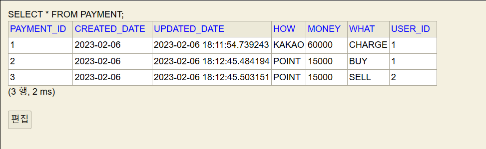
Payment 엔터티

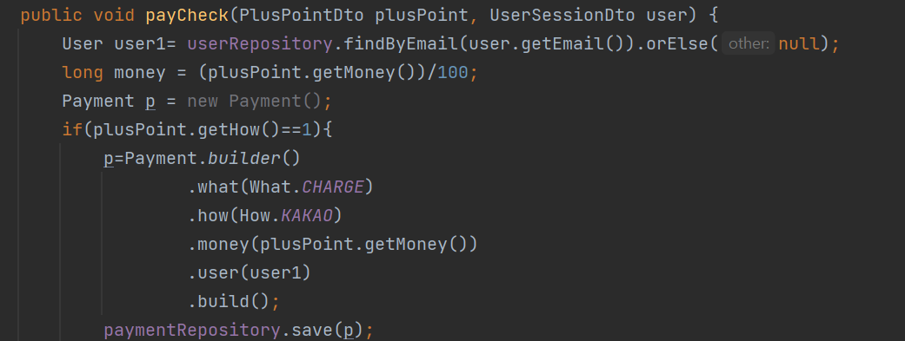
충전. 포인트는 원화에서 100을 나눈다.

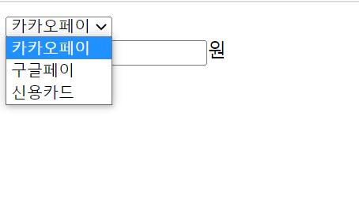
### 장터

머천다이즈 장터는 모두가 올릴수 있고 이를 사고 팔수 있게끔 설계했다.

누군가 올린 상품을 그 다른 누군가가 사게되면, 그 포인트가 판매자에게 전달될수 있도록 설계하였으며, 그또한 이력이 남게끔 payment에 기록된다.

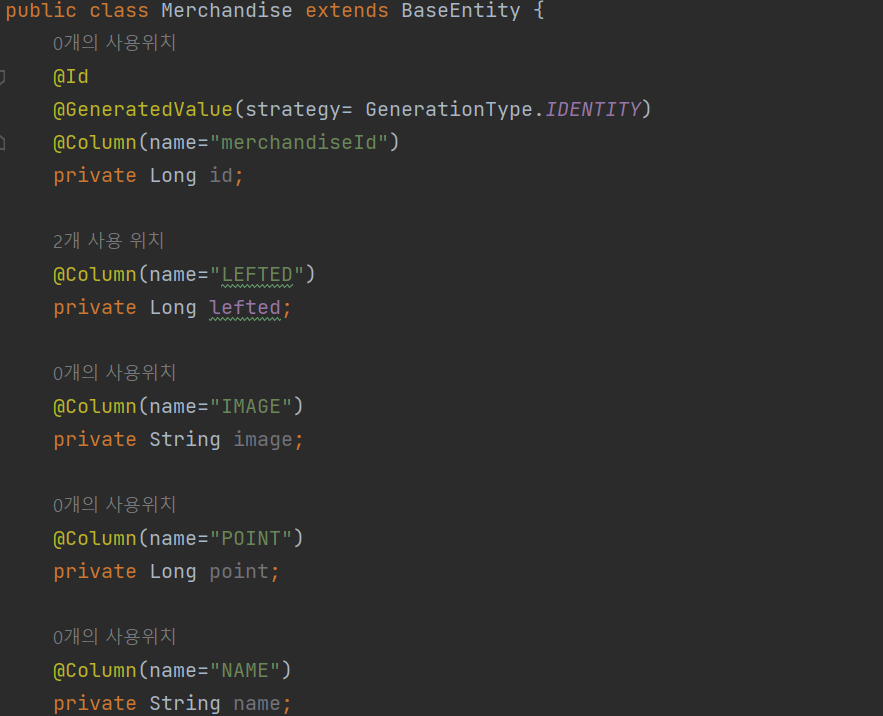

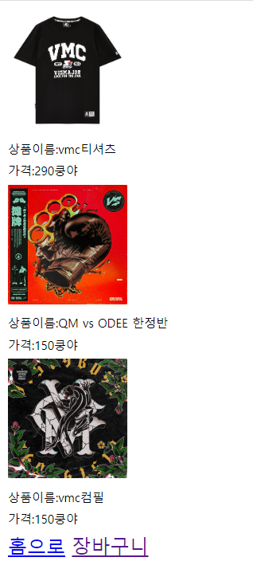
장터 페이지. 사실 바둑판식으로 배열하고
싶었으나, html 구조를 어떻게 짜야할지 몰라서
일단 이렇게 짰다… 상당히 보기싫어서 조만간
수정할듯싶다…

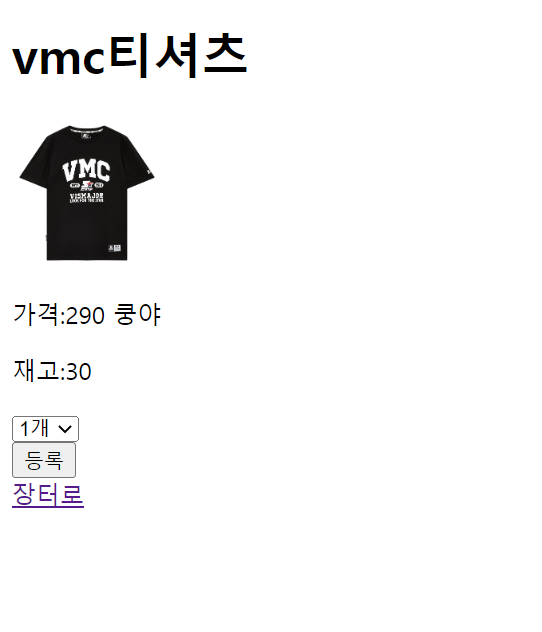
상세페이지.

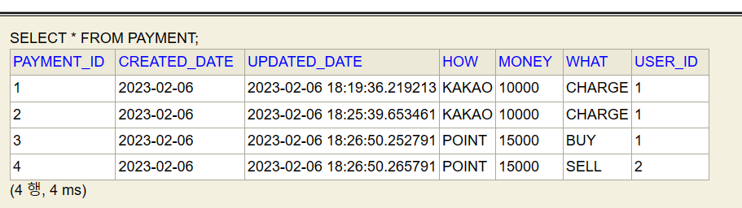
구매하면

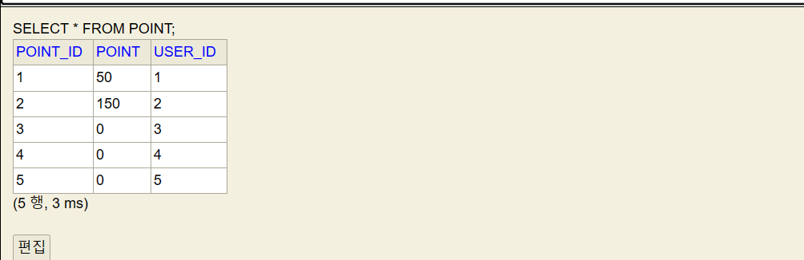
잘 전달된다.

### 결제 로직

장터 상세 페이지 → 장바구니담기 → 장바구니에서 결제.

순으로 결제가 진행된다.

실패로직은

1. 내가가진 포인트가 장바구니에 담긴 상품들의 가격보다 적을때.
2. 재고가 없을때

로 분류하였다.

아마 결제가 실패되는 경우의 수는 더 있기에

추후에 보수가 필요할듯 싶다.

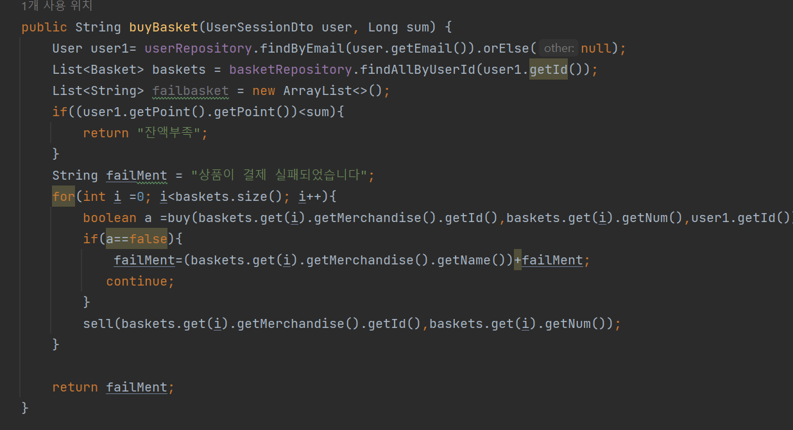
서비스에는 세션 로그인 정보만 보낸다.

어차피 내 로그인 정보에 장바구니를 찾아서 결제하면 되기 때문.

처음엔 List로 묶어서 DB에 저장해야 되나 싶었는데

너무 복잡하게 생각한것 같아 그냥 로그로 남겨지는 식으로 DB에 저장했다.

아직 대규모 배포는 아니어서 괜찮지만,

아마 서비스되면 터지기에 다른 방법도 있는지 찾아봐야겠다.

또한 반환값은 String failMent로 반환해 따로 컨트롤러에서 수정해야할 필요 없이 바로 가져다가 쓸수있도록 처리하였다.

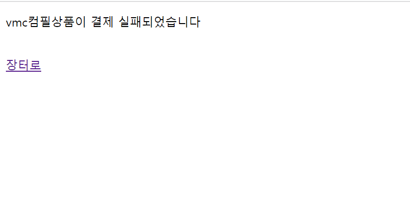
멘트가 그대로 보내져 실패창으로 리다이렉트 된다.

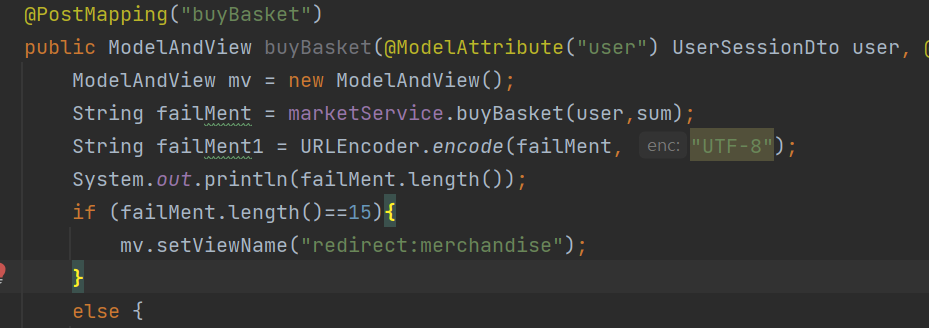
조금 황당하지만.

멘트 글자수에 따라 리다이렉트 되도록 설정했다…

만약 성공하면 뒤에 아무런 말추가 없이 “상품이 결제 실패되었습니다” 총 15글자가 반환되니까…..

내가 생각해봐도 안좋은 로직이다….

이건 다시 생각해볼필요가 있다.

### 느낀 점

프로젝트는 오늘이 마지막이었지만, 확실히 결제시스템은 더많은 고민이 필요한 부분 같다.

그런 점에서 이 프로젝트는 취직할때까지 끝나지 않을것이다.

6주간의 프로젝트 끝에 참 많은 것을 배웠다.

불과 6주전만해도 준비가 얼추 됐다고 생각한 내 자신이 부끄러워질정도로

많은 성장을 이뤘다.

재연상이 아닌 다른 사람이었다면,

정말 이정도의 성과는 내지 못했을 것이다.

그동안의 보람이 있는 만큼, 앞으로 이 프로젝트는 여기서 멈추지않고 개선 될것이다.

다시한번 재연상에게 무한한 감사를 드린다.